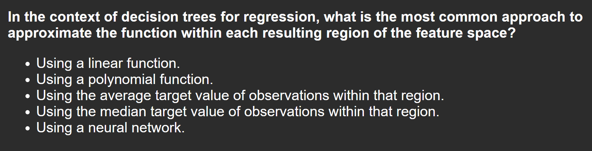
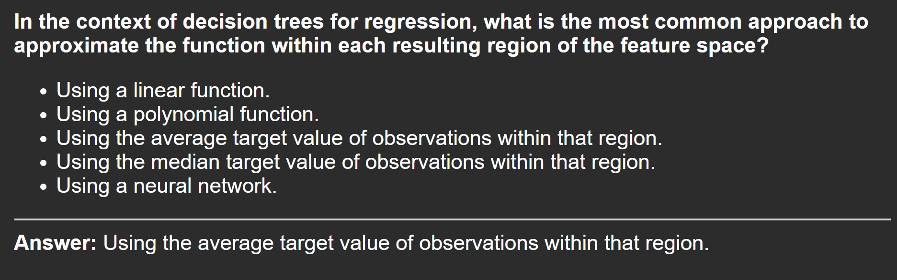

## Overview

This project streamlines the process of turning your lecture notes, textbooks, or PDFs into ready-to-use Anki decks. It leverages large language models (LLMs) to extract, summarize, and format educational content into flashcards, saving you hours of manual work.

## Demo

### Project Workflow


### Example Flashcards




---

## Directory Structure

```
.
├── src/                # Source code for processing and deck creation
├── data/               # Input and output files
├── tests/              # Unit tests
├── out/                # Generated decks and intermediate files
├── requirements.txt    # Python dependencies
├── config.py           # Configuration
├── README.md           # This file
└── ...
```

## Customization

- **Prompts:**  
  Modify the prompts in `src/preprocess_text.py` to suit your subject or style.

- **Deck Styling:**  
  Edit the CSS in `config.py` or `src/create_anki_deck.py` to change the look of your flashcards.

